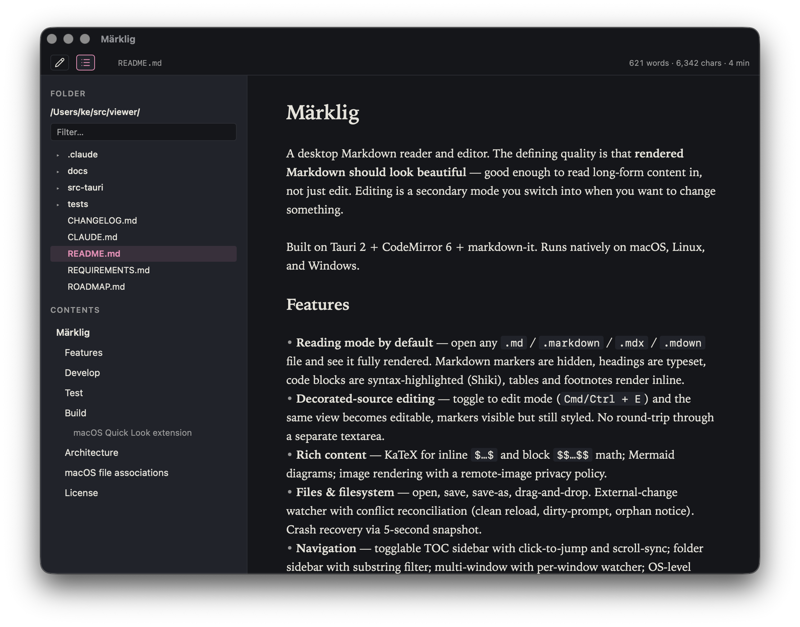

# Märklig

A desktop Markdown reader and editor. The defining quality is that **rendered Markdown should look beautiful** — good enough to read long-form content in, not just edit. Editing is a secondary mode you switch into when you want to change something.

Built on Tauri 2 + CodeMirror 6 + markdown-it. Runs natively on macOS, Linux, and Windows.



## Features

- **Reading mode by default** — open any `.md` / `.markdown` / `.mdx` / `.mdown` file and see it fully rendered. Markdown markers are hidden, headings are typeset, code blocks are syntax-highlighted (Shiki), tables and footnotes render inline.
- **Decorated-source editing** — toggle to edit mode (`Cmd/Ctrl + E`) and the same view becomes editable, markers visible but still styled. No round-trip through a separate textarea.
- **Rich content** — KaTeX for inline `$…$` and block `$$…$$` math; Mermaid diagrams; image rendering with a remote-image privacy policy.
- **Files & filesystem** — open, save, save-as, drag-and-drop. External-change watcher with conflict reconciliation (clean reload, dirty-prompt, orphan notice). Crash recovery via 5-second snapshot.
- **Navigation** — togglable TOC sidebar with click-to-jump and scroll-sync; folder sidebar with substring filter; multi-window with per-window watcher; OS-level Recents on macOS (NSDocumentController).
- **Export** — PDF via the OS print dialog; self-contained HTML with sanitized output (DOMPurify).
- **Search** — find/replace panel (`@codemirror/search`) in both modes.
- **Themes** — light, dark, follow-OS. Document zoom (`Cmd/Ctrl + 0/+/-`).
- **A11y & i18n** — modal a11y, reduced-motion respect, keyboard-navigable TOC, WCAG-AA contrast on muted text, i18n string extraction.

## Develop

```bash
npm install
npm run tauri:dev   # Tauri dev server (recommended)
npm run dev         # Vite-only (browser, no native shell)
```

### Testing the `md` CLI against your working tree

`npm run tauri:dev` runs an unbundled binary, so it is **not** registered with
macOS LaunchServices — `open -a` / the `md` launcher can't target it and
`RunEvent::Opened` never fires. To exercise the file-open and window-routing
flow (issues #100/#137/#141/#142) you need a real `.app`. Build a debug bundle
and drive it with the `md-dev` helpers instead of reinstalling into
`/Applications`:

```bash
npm run md-dev:build     # tauri build --debug --bundles app (faster than release)
npm run md-dev:launch    # quit the installed app, run the debug build, stream logs
scripts/md-dev some/dir  # in another shell: behaves like `md`, but hits the debug build
scripts/md-dev a/b/file.md
```

`md-dev:launch` quits any running instance first because a debug bundle shares
the installed app's bundle id — otherwise `open` would route events to the
installed copy. Logs (Rust `eprintln!` plus anything the frontend forwards to
stderr) stream to the terminal and to `/tmp/marklig-dev.log` (override with
`MD_DEV_LOG`).

### Website

The marketing site at `kek.github.io/marklig` is built from this repo —
it's the desktop reading mode rendering `website/content.md` through the
exact same decoration producers as the app. Treat it like any other
deploy target.

```bash
npm run website:dev       # local dev server with HMR
npm run website:build     # static build → website/dist/
npm run website:preview   # serve the built output locally
```

`.github/workflows/pages.yml` runs the build on every push to `trunk`
and deploys to GitHub Pages. The Pages source must be set to "GitHub
Actions" in repo Settings → Pages (one-time).

### Android (mobile companion — v2.0, work in progress)

The Android target is the first step of the v2 mobile companion (issue #70,
spec at `docs/superpowers/specs/2026-05-17-mobile-companion-design.md`).
At this stage the app renders a bundled `src/sample.md` only — no file
picking, no share-sheet integration, no sync. Library UI and sync land in
later steps.

One-time setup:

1. Install Android Studio → AVD Manager → create an ARM64 API 34+ emulator.
2. Install the NDK via Android Studio's SDK Manager.
3. Export `NDK_HOME` in your shell rc (`~/.config/fish/config.fish` for fish,
   `~/.zshrc` / `~/.bashrc` otherwise):
   ```sh
   export NDK_HOME="$ANDROID_HOME/ndk/$(ls $ANDROID_HOME/ndk | tail -1)"
   ```
4. Add the Android Rust targets (only `aarch64-linux-android` is strictly
   needed for Apple-Silicon ARM64 emulators; the others are for broader
   device coverage in release builds):
   ```sh
   rustup target add aarch64-linux-android armv7-linux-androideabi \
                      x86_64-linux-android i686-linux-android
   ```

Dev loop:

```bash
# 1. Launch an emulator from Android Studio's Device Manager.
# 2. Confirm it's online:
adb devices
# 3. Run the Android dev server (first run is slow — downloads Gradle / AGP).
npm run tauri:android:dev
```

Release / debug builds (no signing wired yet — debug only):

```bash
npm run tauri:android:build:debug
```

**Gotcha — switching between `dev` and `build`:** `tauri android dev`
injects the host machine's LAN IP as `devUrl` into Gradle's
intermediate config (`src-tauri/gen/android/app/build/intermediates/`).
A subsequent `tauri android build --debug` *reuses* that stale
intermediate even though the source `tauri.conf.json` is clean — the
WebView in the installed APK then tries to fetch from `http://<host
LAN IP>:1420/` and fails with "Failed to request …". Workaround:
delete the intermediates before switching modes:

```bash
rm -rf src-tauri/gen/android/app/build/intermediates
npm run tauri:android:build:debug
```

This is a Tauri 2.11 / Gradle incremental-cache interaction; if it
gets fixed upstream the workaround becomes harmless.

## Test

```bash
npm test             # Vitest unit suite
npm run test:watch
npm run test:e2e     # Playwright e2e (open, edit, external change, visual regression)
```

## Build

```bash
npm run tauri:build
```

CI matrix runs Ubuntu, macOS, and Windows on every push.

### macOS Quick Look extension

The macOS build ships a Quick Look preview + thumbnail extension so pressing
Space on a `.md` file in Finder shows a fully rendered preview matching
Viewer's reading mode, and column-view thumbnails get a branded "MD" badge
plus the document's first heading.

The extension is a pair of `.appex` bundles in `src-tauri/macos/quicklook/`,
built with a hand-rolled `xcrun swiftc` script (no Xcode project needed).

```bash
# 1. Build the .appex bundles (universal arm64 + x86_64, ad-hoc signed):
scripts/build-quicklook.sh
# → target/quicklook/ViewerQuickLook.appex
# → target/quicklook/ViewerThumbnail.appex

# 2. Build the host .app:
npm run tauri:build

# 3. Copy the extensions into the .app's PlugIns directory:
scripts/build-quicklook.sh --install \
    src-tauri/target/release/bundle/macos/Viewer.app

# 4. Drag Viewer.app to /Applications. Finder registers the extensions on
#    first launch; pressing Space on any .md file then shows the rendered
#    preview, and Finder's column / icon views use the branded thumbnail.
```

To smoke-test the renderer or the bundles in isolation:

```bash
scripts/test-quicklook.sh         # Swift fixtures for MarkdownRenderer
qlmanage -p some.md               # render the preview to a Quick Look window
qlmanage -t -s 256 -o /tmp some.md  # render a thumbnail PNG
```

See `src-tauri/macos/quicklook/README.md` for architecture notes, the
sanitisation contract, what's deliberately deferred (math, Mermaid,
syntax highlighting in code blocks), and the macOS 14+ format details
(the thumbnail `Info.plist` declares the extension via both
`EXAppExtensionAttributes` and `NSExtension`; the preview point only
exists as a legacy `NSExtension` point on Tahoe).

> Note: runtime activation by quicklookd requires a real `TeamIdentifier`.
> Ad-hoc signed extensions register with `pluginkit` but are not spawned
> into the sandboxed XPC pool, so end-to-end thumbnail/preview rendering
> verifies only on a Developer ID-signed build.

## Architecture

- `src/editor/` — CodeMirror setup, markdown-it parser, decoration producers (one per construct: headings, inline, lists, links, images, blockquotes, tables, code blocks, front matter, footnotes, math, mermaid, reading-mode widgets).
- `src/shell/` — file lifecycle, watcher, settings, recents, recovery, close handling.
- `src/ui/` — toolbar, modal, sidebar (folder + TOC), preferences, shortcuts, titlebar.
- `src/export/` — HTML and sanitization for export.
- `src-tauri/` — Rust shell: file I/O, watcher (notify-debouncer-full), native menus.

See `REQUIREMENTS.md` for the full v1 spec and `ROADMAP.md` for the sub-spec breakdown and shipping status.

## macOS file associations

Viewer's `Info.plist` declares itself as an editor for `.md`, `.markdown`, `.mdx`, and `.mdown` files via `CFBundleDocumentTypes`, and it exports the `net.daringfireball.markdown` UTI (conforming to `public.plain-text`). When you install the built `Viewer.app` into `/Applications`, macOS LaunchServices picks this up automatically the first time the app is launched, indexed by Spotlight, or copied to a tracked location.

If "Open With → Viewer" doesn't show up in Finder, force-register the bundle:

```bash
/System/Library/Frameworks/CoreServices.framework/Versions/A/Frameworks/LaunchServices.framework/Versions/A/Support/lsregister -f /Applications/Viewer.app
```

(Useful when you ran a fresh build out of the source tree without copying it to `/Applications`, or after replacing the bundle in place.)

To set Viewer as your default Markdown handler:

1. In Finder, right-click any `.md` file and choose **Get Info**.
2. Under **Open with**, select **Viewer**.
3. Click **Change All…** to apply the choice to every `.md` file.

Repeat for `.markdown`, `.mdx`, and `.mdown` if you want them handled the same way — macOS keeps a separate default handler per extension/UTI.

When Viewer is already running, double-clicking a `.md` file in Finder routes through Tauri's `RunEvent::Opened`. The Rust shell forwards the path to the focused (or, failing that, main) window only — other open Viewer windows aren't disturbed — and brings that window forward.

## License

MIT — see [LICENSE](LICENSE).
