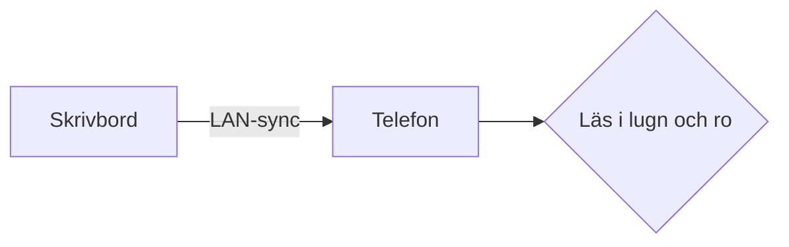

# Märklig på telefonen

Det här är *Märklig* på Android — samma renderare som på skrivbordet,
samma typografi, samma uppmärksamhet på detaljer. **Du läser nu en
inbäddad provtext** som visar att de viktigaste byggstenarna fungerar.

## Vad som testas här

- ATX-rubriker (H1 och H2)
- En punktlista med formaterad text
- En **fetstil** och *kursiv* mitt i en mening
- En `inline-kodspan`
- En länk till [Märklig på GitHub](https://github.com/kek/marklig)

> Citatblock ska få en lugnare stil — inte skrikig, men avskild.
> Två rader för att verifiera att radbrytning inom citatet stämmer.

## Kod

```rust
fn greet(name: &str) -> String {
    format!("Hej, {}!", name)
}
```

## Matematik

Einsteins formel: $E = mc^2$, renderad via KaTeX.

## Diagram



---

Om allt ovanför ser ordentligt ut är steg 1 i den mobila följeslagaren
färdig. Filhantering, parning och synk kommer i senare steg.
